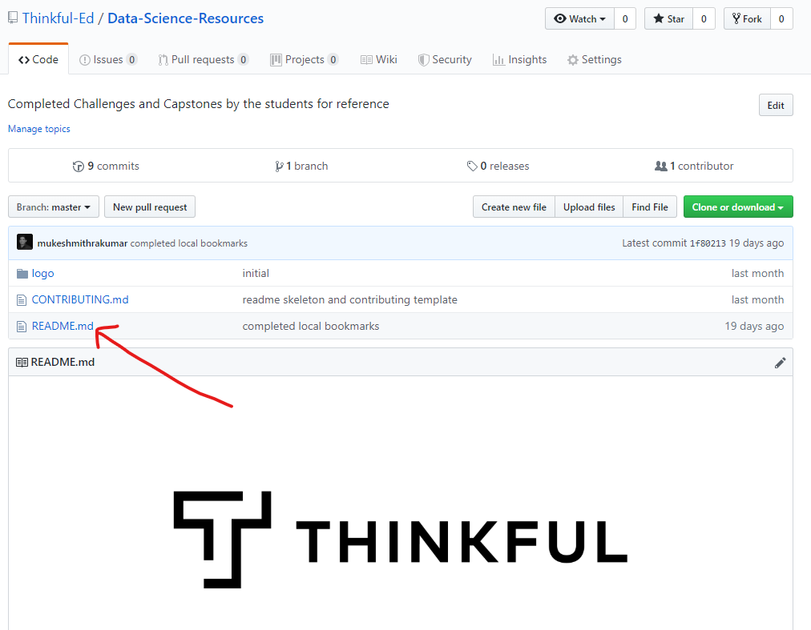
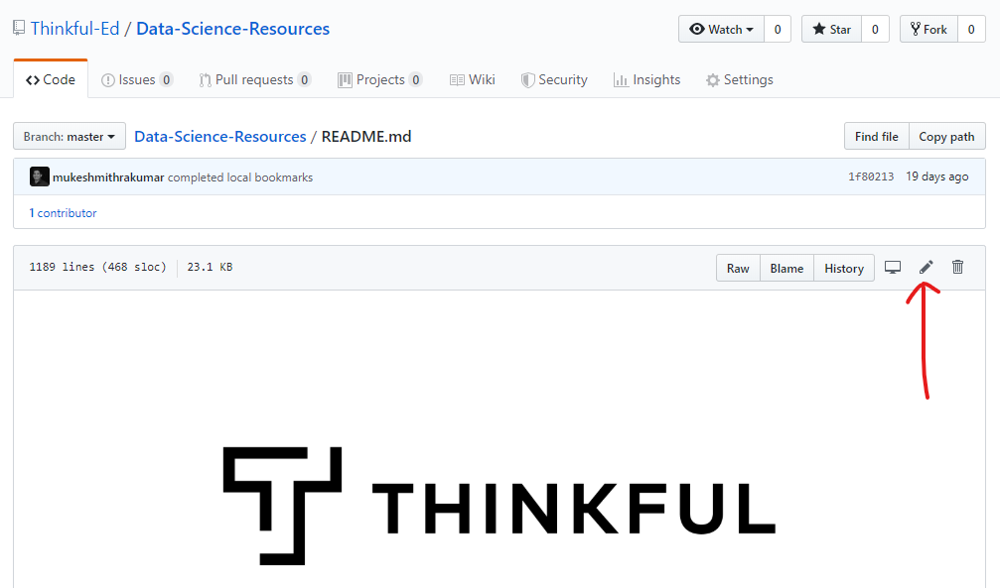
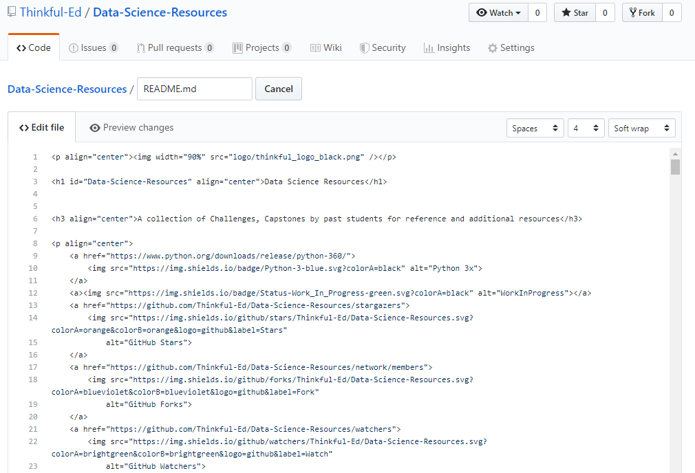
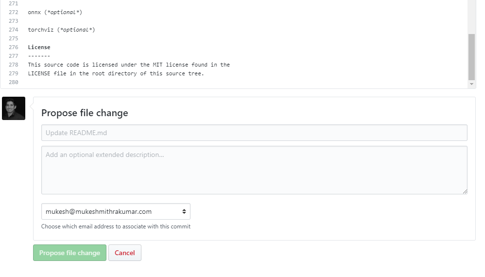

# Contributing guidelines

## Pull Request Checklist

Please ensure your pull request adheres to the following guidelines:

- Search previous suggestions before making a new one, as yours may be a duplicate.
- Make sure what you add is useful before submitting.
- Use the following format: `[Name](link)`
- Link additions should be added to the bottom of the relevant category.
- New categories or improvements to the existing categorization are welcome.
- Check your spelling and grammar.
- Make sure your text editor is set to remove trailing whitespace.
- The pull request and commit should have a useful title.
- The body of your commit message should contain a link to the repository.

Thank you for your suggestions!

## Adding something to the resources

If you have something awesome to contribute, this is how you do it.

You'll need a [GitHub account](https://github.com/join)!

1. Go to [main page](https://github.com/Thinkful-Ed/Data-Science-Resources)

2. Click on the `readme.md` file:

3. Now click on the edit icon.

4. You can start editing the text of the file in the in-browser editor.

5. Say why you're proposing the changes, and then click on "Propose file change".

6. Submit the [pull request](https://help.github.com/articles/using-pull-requests/)!

## Updating your Pull Request

Sometimes, the maintainer of this repo will ask you to edit your Pull Request before it is included. This is normally due to spelling errors or because your PR didn't match the guidelines.

[Here](https://github.com/RichardLitt/knowledge/blob/master/github/amending-a-commit-guide.md) is a write up on how to change a Pull Request, and the different ways you can do that.
